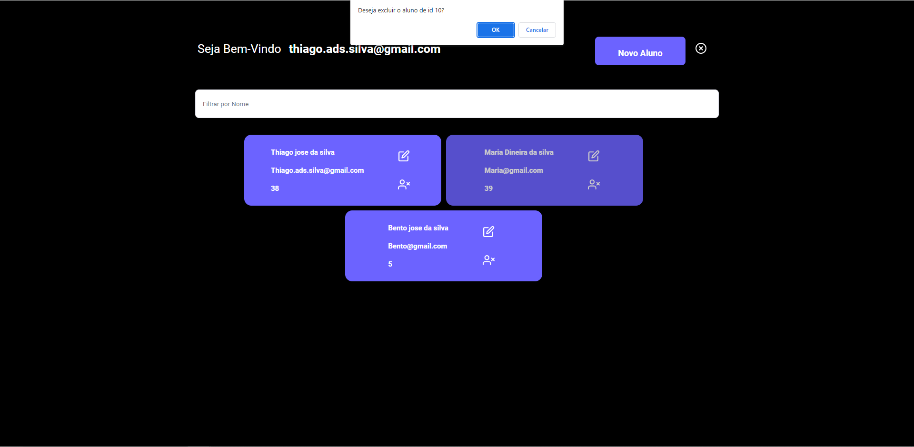

# Projeto - Alunos v2

### Sistema simples que vai fazer as 4 operações de um CRUD, esse projeto vai consumir uma API desenvolvida em C#

### Link para o repositório da API: https://github.com/thiagoadssilva/UdemyApiAlunoReactj

### Dentro do <b>README</b> da pasta do projeto está tudo que foi ou está sendo usando:

https://github.com/thiagoadssilva/UdemyReactjApiAlunoV2/blob/main/clientereact/README.md

## Projeto Publicado: Não foi publicado

## Imagens do projeto

### Entrando no sistema (Usando aqui JWT)

### Listando os Alunos

### Atualizando os Alunos

### cadastrando os Alunos

### Excluindo os Alunos

# Observações: Projeto que falta fazer algumas melhorias (layout, mensagens, etc...)