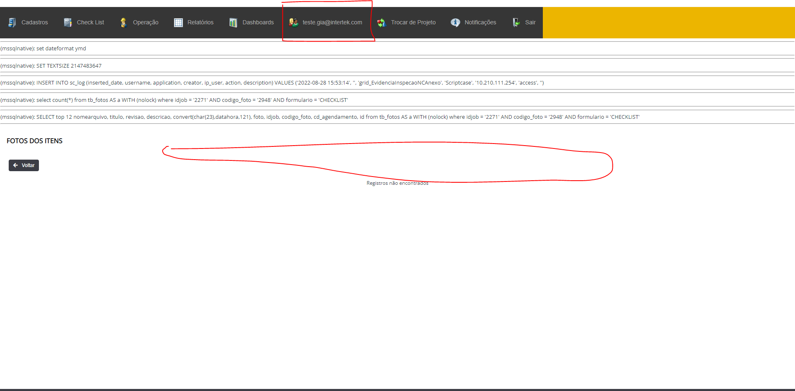

# Projeto - Alunos V2
Esse vai ser um projeto melhorado, pois nele vamos implementar o consumo de uma API criado com aspDotNetCore6 e o diferencial agora é autenticação JWT que foi implementada na API. 

### Link para o repositório da API: https://github.com/thiagoadssilva/UdemyApiAlunoReactj

### Dentro do <b>README</b> da pasta do projeto está tudo que foi ou está sendo usando:

https://github.com/thiagoadssilva/UdemyReactjApiAluno/blob/main/alunosreact/README.md

## Projeto Publicado: ------

## Gif do projeto

## Imagens do projeto

### Listando os Alunos

### Cadastrando os Alunos

### Atualizando os Alunos

### Excluindo os Alunos

